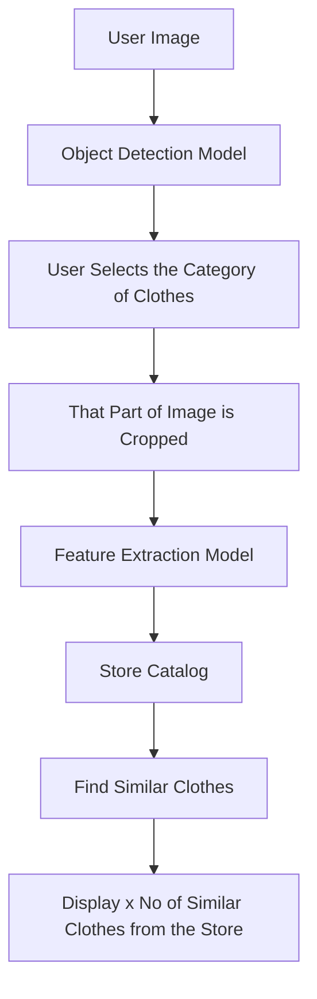

# ShopLens – AI Shopping Assistant 

ShopLens is an AI-powered augmented reality shopping assistant that combines object detection, image-based search, and conversational recommendations to enhance the retail experience. It allows users to get detailed information about products by simply pointing their phone camera and interacting through an intelligent chatbot.

---
## System Architecture


---
## Methodology

ShopLens consists of three core modules that work together seamlessly:

### 1. **Object Detection with YOLOS**

* Uses the `hustvl/yolos-small` transformer-based object detection model.
* Detects fashion items (e.g., shirts, dresses, shoes) in real-time from the camera feed.
* The highest scoring detection is selected for further processing.

### 2. **Feature Extraction with FashionCLIP**

* The detected item is passed to **FashionCLIP**, a fine-tuned CLIP model for the fashion domain.
* Embeds the image into a high-dimensional vector space.
* Computes cosine similarity between this embedding and pre-embedded dataset images.
* Top 3 most similar items are retrieved.

### 3. **Chatbot Interaction**

* The selected top-k results are passed to a chatbot interface.
* A language model responds to user queries about the items.
* Users can interact naturally using text or speech.

---

## 📐 Results & Evaluation

To evaluate our retrieval system, we used the **Recall@K** metric, specifically **Recall@6**.

### 📊 What is Recall@K?

**Recall@K** measures how often the correct image is found in the top K retrieved results for a given text query.

### 🧮 Evaluation Details

Let `T = {t₁, t₂, ..., tₙ}` be the set of text embeddings, and `I = {i₁, i₂, ..., iₙ}` the set of image embeddings.  
The similarity between `tₖ` and `iⱼ` is computed as the dot product:

```
score(tₖ, iⱼ) = tₖᵀ · iⱼ
```

Let **Top6(tₖ)** be the indices of top 6 images sorted by similarity score with `tₖ`.  
Then the number of correct predictions is:

```
correct = Σ 1{k ∈ Top6(tₖ)}
```

Final Recall is:

```
Recall = correct / n = 0.68
```

📈 This means that in **68% of the cases**, the correct item was retrieved in the top 6 results.

---

## Features

* Real-time object detection from camera
* Visual similarity-based fashion search
* Conversational interface for product queries
* Seamless integration of detection, search, and chatbot modules

---

##  Tech Stack

* Python
* Streamlit (for UI)
* PyTorch (YOLOS, FashionCLIP)
* Hugging Face Transformers
* FAISS (for similarity search)
* Gemini / LLMs (for chatbot)

---

## Installation

```bash
git clone https://github.com/Raihan2511/ShopLens-AI-Shopping-Assistant.git
cd shoplens
pip install -r requirements.txt
streamlit run app.py
```

---

## Dataset

* Custom-scraped dataset of fashion products from sites like Amazon, Myntra, and Flipkart.
* Each item includes image, title, description, and price.
* Image embeddings are pre-computed using FashionCLIP.

---

##  How It Works

1. User opens the app and scans a fashion item.
2. YOLOS detects the main product (e.g., "blue sneakers").
3. Detected image is embedded via FashionCLIP.
4. Similar items are retrieved based on cosine similarity.
5. Chatbot presents results and answers user queries.

---

## Results

* YOLOS enables fast and accurate detection on fashion items.
* FashionCLIP returns semantically relevant visual matches.
* Chatbot enhances user experience with intelligent conversation.

---

##  Future Work

* Integrate real-time pricing from e-commerce APIs
* Extend support to multi-object and multi-category detection
* Add personalization and recommendation memory features

---

## 📝 License

This project is licensed under the MIT License. See `LICENSE` for details.

---

## 🙋‍♂️ Authors

* Sayan Das
* Raihan Uddin

